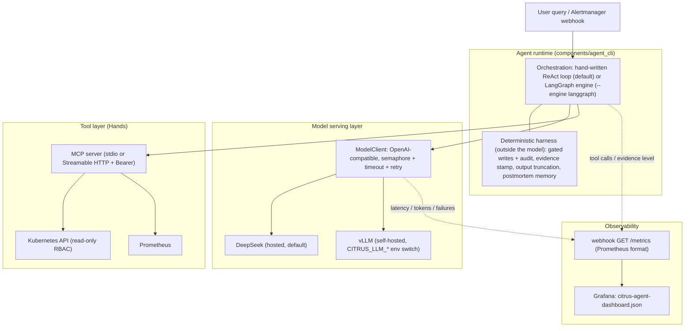

# Citrus-Orchestrator

## Demo

Chaos kill → K8s self-heal → Agent RCA + recovery validation

[](https://youtu.be/TZQj9dzH72A)

---

Local Kubernetes platform for progressive delivery, observability, and Agentic SRE diagnostics.

Workload: [OpenTelemetry Demo](https://github.com/open-telemetry/opentelemetry-demo) (Helm).  
Ops layer (this repo): monitoring stack, canary tooling, MCP server, hand-written ReAct agent CLI, Chaos Mesh demos.

## What this repo is

| Layer | What | Where |
|-------|------|--------|
| Target app | otel-demo microservices | `deploy/helm/otel-demo-values.yaml` |
| Observability | Prometheus, Grafana, Jaeger + agent runtime `/metrics` | `deploy/helm/*`, `deploy/grafana/`, `components/agent_cli/metrics.py` |
| Canary / MLOps | metric-based deploy + rollback | `scripts/canary/` |
| MCP server | K8s/Prometheus tools over MCP | `components/mcp-server/` |
| Agent CLI | hand-written ReAct loop + hard evidence stamp | `components/agent_cli/` |
| Model serving | provider-agnostic `ModelClient` (DeepSeek hosted / self-hosted vLLM) | `components/agent_cli/llm_client.py`, `docs/VLLM.md` |
| Chaos | PodChaos + demo scripts | `infra/chaos/` |
| RBAC / deploy | least-privilege SA + manifests | `infra/rbac/`, `infra/manifests/` |

**Transports**
- Local default: Agent spawns MCP over **stdio**
- Optional: MCP **Streamable HTTP** in-cluster (`--transport streamable-http`, Service + Bearer token)

## Architecture



## Evolution (V1 → V4)

The commit history follows a deliberate path, not a framework tutorial:

1. **V1 — hand-written ReAct.** Implement the agent loop from scratch (reason → tool call → observe) to understand what a framework would otherwise hide: message shaping, tool-call parsing, step budgets.
2. **V2 — harness, not loop.** Production problems turned out to live outside the loop: write-tool approval gates with audit logs, a deterministic evidence stamp computed from tool-call stats (never by the LLM), output truncation, postmortem memory, RCA eval with a frozen baseline.
3. **V3 — orchestration as a swappable layer.** The same harness now runs under two engines: the hand-written ReAct loop (default) and a LangGraph `StateGraph` (`--engine langgraph`). The orchestration layer changed; gated writes, evidence, and eval did not.
4. **V4 — model inference as a serving layer.** `LLMClient` became a provider-agnostic `ModelClient` with a concurrency semaphore, per-request timeout, and bounded retries. A `CITRUS_LLM_*` env switch points the same agent at hosted DeepSeek or a self-hosted vLLM endpoint, with inference latency / token / failure metrics scraped into Grafana. See [docs/VLLM.md](docs/VLLM.md).

## Design decisions & trade-offs

- **Hand-written ReAct kept next to LangGraph.** Writing the loop first made the failure modes visible (empty responses, malformed tool args, runaway steps). LangGraph was added later as an alternative engine to show the orchestration layer is replaceable.
- **Evidence stamp is computed in code, not by the model.** An LLM grading its own answer is not a control. `evidence.py` derives HIGH/MEDIUM/LOW from tool-call statistics; zero tool calls is always LOW, and the webhook never publishes a LOW answer as a root cause.
- **Write tools are gated, reads are free.** Diagnosis needs broad read access; mutation needs a human y/n plus a JSONL audit trail. Soft control (prompting the model not to write) was rejected — the gate is enforced in the tool dispatch path, where the model cannot negotiate.
- **Reliability lives in the client, not the loop.** Timeout, retry with backoff+jitter, and a concurrency cap sit inside `ModelClient` / the tool executor. The ReAct loop only keeps a coarse circuit breaker (stop after repeated LLM errors), so orchestration stays readable.
- **stdio by default, HTTP when shared.** Spawning MCP over stdio keeps the local loop zero-config and inherits the operator's kubeconfig; the in-cluster Streamable HTTP deployment adds Bearer auth, NetworkPolicy, and a namespace-scoped read-only ServiceAccount. Different trust boundaries, both explicit.
- **Metrics are optional at import, mandatory in ops.** `prometheus_client` is an extra (`pip install -e ".[metrics]"`); without it every metric helper is a no-op, so the CLI path carries no extra dependency, while the long-lived webhook process exposes `/metrics` for Prometheus.

## Quick start

### Prerequisites

- kubectl, Helm 3, a local cluster (Kind / Docker Desktop / Minikube)
- Python 3.12+, `DEEPSEEK_API_KEY` for the agent

### 1. Deploy platform

```powershell
.\scripts\deployment\0-deploy-all.ps1
```

Or step by step:

```powershell
.\scripts\deployment\1-deploy-infrastructure.ps1
.\scripts\deployment\2-deploy-application.ps1
```

Port-forwards (examples):

```powershell
kubectl port-forward -n citrus svc/otel-demo-frontendproxy 8080:8080
kubectl port-forward -n citrus svc/monitoring-grafana 3000:80
kubectl port-forward -n citrus svc/monitoring-kube-prometheus-prometheus 9090:9090
kubectl port-forward -n citrus svc/jaeger 16686:16686
```

### 2. Run the Agent (stdio)

One-time setup (per venv / machine):

```powershell
cd components
copy agent_cli\.env.example agent_cli\.env
# edit agent_cli\.env → set DEEPSEEK_API_KEY=
pip install -e ".[test]"
pip install -e "mcp-server[test]"
```

Then run:

```powershell
cd components
python -m agent_cli "What is the status of frontend pods in citrus?"
```

The answer ends with an `Evidence check: HIGH|MEDIUM|LOW` footer. That stamp is computed from tool-call stats in code, not by the LLM. Zero tool calls is always LOW.

`python -m agent_cli` needs those editable installs (`pip install -e`). A bare `pip install` of listed packages is not enough (you get `No module named mcp` / `agent_cli`).

### 3. Chaos + diagnosis demo

```powershell
.\infra\chaos\install-chaos-mesh.ps1   # once
.\infra\chaos\run-demo.ps1
cd components
python -m agent_cli "What happened to the frontend pods? RCA + validate recovery."
```

See [docs/DEMO.md](docs/DEMO.md) for the full demo path. Demo recording is at the top of this README.

### 3b. RCA eval (labeled, hard-rule score)

```powershell
cd components
python -m agent_cli.eval_rca --list          # no cluster
python -m agent_cli.eval_rca --all           # live: 3 scenarios, writes data/eval/
```

See [docs/EVAL.md](docs/EVAL.md). Hit = the answer named the labeled fault. Evidence HIGH/MEDIUM/LOW is the separate tool-call stamp.

Frozen baseline (2026-08-13, memory off): **3/3 HIT**, all HIGH, ~8–14s. Ablation (memory on) is compared with `--compare`.

### 3c. Alertmanager webhook (optional)

```powershell
cd components
$env:CITRUS_WEBHOOK_TOKEN="change-me"
python -m agent_cli.webhook --host 0.0.0.0 --port 8088
```

See [docs/WEBHOOK.md](docs/WEBHOOK.md). Card fields: suspected root cause, blast radius, suggested actions, evidence links. LOW evidence is not published as a root cause. If in-cluster Alertmanager cannot reach `host.docker.internal`, curl is the degrade path.

The same server exposes `GET /metrics` (Prometheus format: `citrus_llm_request_seconds`, `citrus_llm_tokens_total`, `citrus_llm_failures_total`, `citrus_tool_calls_total`, `citrus_agent_runs_total`). Install the extra with `pip install -e ".[metrics]"` and import `deploy/grafana/citrus-agent-dashboard.json` into Grafana.

### 4. Optional: HTTP MCP (in-cluster)

```powershell
# after building/loading image mcp-server:v4
kubectl apply -f infra/rbac/mcp-server-rbac.yaml
kubectl apply -f infra/manifests/mcp-server-secret.yaml
kubectl apply -f infra/manifests/mcp-server-service.yaml
kubectl apply -f infra/manifests/mcp-server-networkpolicy.yaml
kubectl apply -f infra/manifests/mcp-server-deployment.yaml
kubectl port-forward -n citrus svc/mcp-server 8080:8080

cd components
$env:MCP_AUTH_TOKEN="change-me-citrus-mcp"  # match Secret
python -m agent_cli --mcp-url http://127.0.0.1:8080/mcp "List pods in citrus"
```

### 5. Optional: self-hosted vLLM serving

The agent switches from hosted DeepSeek to a self-hosted vLLM endpoint with env only — no code change:

```powershell
$env:CITRUS_LLM_PROVIDER="vllm"
$env:CITRUS_LLM_BASE_URL="http://<vllm-host>:8000/v1"
$env:CITRUS_LLM_MODEL="Qwen/Qwen2.5-1.5B-Instruct"
cd components
python -m agent_cli "What is the status of frontend pods in citrus?"
```

Setup (Colab T4 walkthrough, tunneling, scraping vLLM `/metrics`): [docs/VLLM.md](docs/VLLM.md).

Load test against any OpenAI-compatible endpoint (concurrency sweep, P50/P95, throughput):

```powershell
python scripts/tests/load_test_llm.py --base-url http://<vllm-host>:8000/v1 --model Qwen/Qwen2.5-1.5B-Instruct --concurrency 1 4 16
```

Results and analysis (Colab T4, 2026-09-20): throughput 0.323 → 1.096 req/s from concurrency 1 → 4 (continuous batching); P95 3.8 s → 14.6 s at concurrency 16 (queueing). Full table: [docs/VLLM.md](docs/VLLM.md#model-serving--performance-results).

### 6. Optional: LangGraph engine

```powershell
cd components
pip install -e ".[langgraph]"
python -m agent_cli --engine langgraph "What is the status of frontend pods in citrus?"
```

Same MCP tools, same gated writes, same evidence stamp — only the orchestration layer changes. The hand-written ReAct loop stays the default.

## Layout

```
Citrus-Orchestrator/
├── components/                 # Python packages
│   ├── agent_cli/              # ReAct + LangGraph, ModelClient, webhook, metrics
│   └── mcp-server/             # MCP tools (stdio / Streamable HTTP)
├── deploy/
│   ├── helm/                   # monitoring, jaeger, otel-demo values
│   └── grafana/                # agent dashboard JSON
├── infra/
│   ├── alerting/               # PrometheusRule + sample Alertmanager payload
│   ├── chaos/                  # Chaos Mesh install + PodChaos
│   ├── manifests/              # MCP Deployment / Service / NetworkPolicy
│   └── rbac/                   # read-only Role for MCP SA
├── scripts/
│   ├── deployment/             # PowerShell IaC
│   ├── canary/                 # metric-based deploy + rollback
│   └── tests/                  # bats + load_test_llm.py
├── docs/                       # public English docs (index in docs/README.md)
├── data/                       # runtime artifacts (gitignored)
└── README.md
```